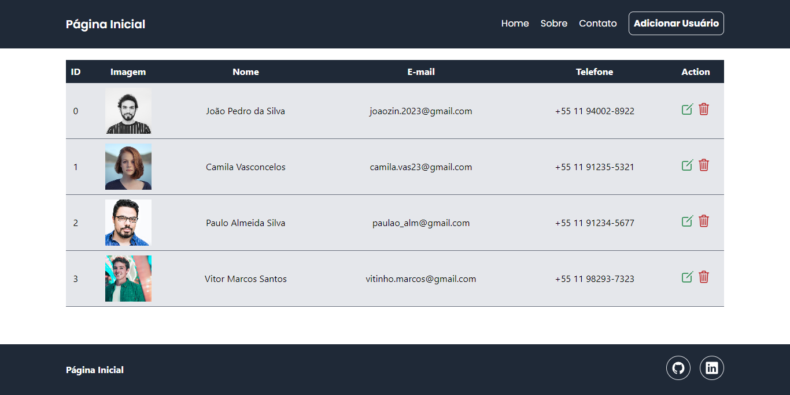

<h1 align="center"> Aplicação CRUD </h1>

  Uma aplicação CRUD completa

  <a href="#-tecnologias">Tecnologias</a>&nbsp;&nbsp;&nbsp;|&nbsp;&nbsp;&nbsp;
  <a href="#-projeto">Projeto</a>&nbsp;&nbsp;&nbsp;|&nbsp;&nbsp;&nbsp;
  <a href="#-contato">Contato</a>

  

 

  

## 🚀 Tecnologias

Esse projeto foi desenvolvido com as seguintes tecnologias:

- Node.js
- Express
- EJS
- Tailwind CSS
- MongoDB

## 💻 Projeto

Esta é uma aplicação web construída utilizando Node.js para o backend, Express como framework web, EJS para renderização de páginas, Tailwind CSS para estilização e MongoDB como banco de dados para armazenamento dos dados dos usuários, incluindo suas fotos de perfil.

Para começar, basta baixar o repositório e, com o diretório aberto, executar o comando `npm install` no terminal para instalar as dependências necessárias. Em seguida, para iniciar a aplicação, utilize o comando `npm start`.

## Contato

- Acesse também meus outros repositórios no [Github](https://github.com/matheusfdosan?tab=repositories).
